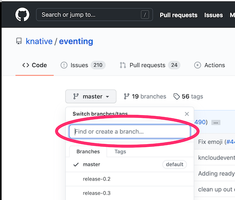
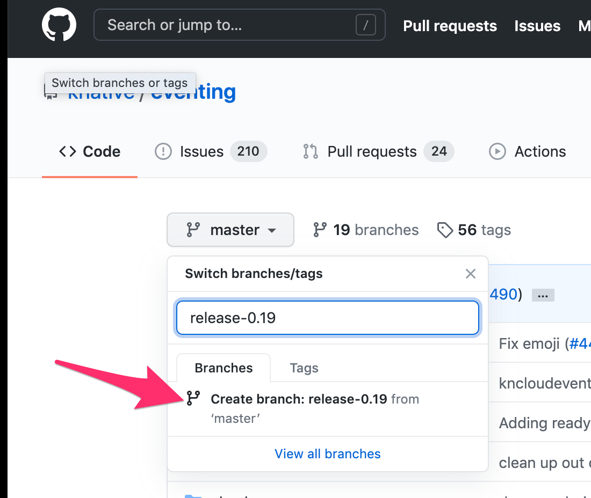
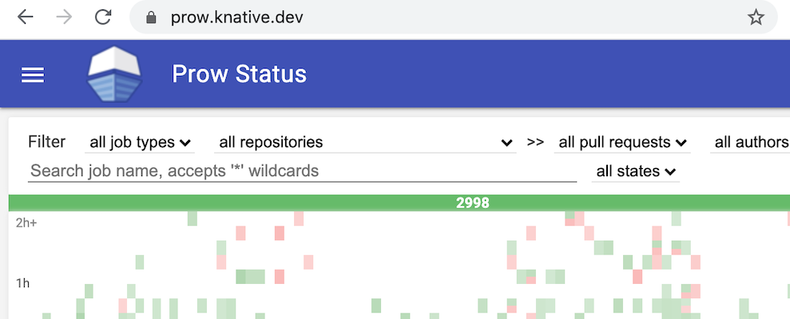
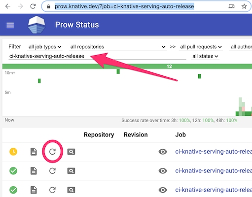
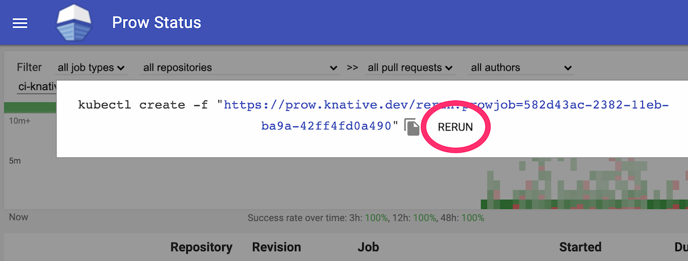

# Release Leads

For each release cycle, we dedicate a team of two individuals, one from Eventing
and one from Serving, to shepherd the release process. Participation is
voluntary and based on good faith. We are only expected to participate during
our local office hour.

# Roster

We seed this rotation with all approvers from all the Serving and Eventing
workgroups, excluding productivity. If you are no longer active in Knative, or
if you are contributing on personal capacity and do not have time to contribute
in the rotation, feel free to send a PR to remove yourself.

## Serving roster

This roster is seeded with all approvers from Serving workgroups.

- dprotaso
- julz
- JRBANCEL
- markusthoemmes
- mattmoor
- nak3
- tcnghia
- vagababov
- yanweiguo
- ZhiminXiang

## Eventing roster

This roster is seeded with all approvers from Eventing workgroups.

- evankanderson
- grantr
- Harwayne
- lionelvillard
- matzew
- n3wscott
- nachocano
- slinkydeveloper
- vaikas

## Schedule

| Release | Release Date | Serving        | Eventing        | Unpin repos | PKG cut    |
| ------- | ------------ | -------------- | --------------- | ----------- | ---------- |
| v0.17   | 2020-08-18   | yanweiguo      | Harwayne        | -           | 2020-08-11 |
| v0.18   | 2020-09-29   | ZhiminXiang    | n3wscott        | 2020-08-19  | 2020-09-22 |
| v0.19   | 2020-11-10   | julz           | n3wscott        | 2020-09-30  | 2020-11-03 |
| v0.20   | 2021-01-12   | nak3           | slinkydeveloper | 2020-11-11  | 2021-01-07 |
| v0.21   | 2021-02-23   | mattmoor       | lionelvillard   | 2021-01-13  | 2021-02-16 |
| v0.22   | 2021-04-06   | markusthoemmes | evankanderson   | 2021-02-24  | 2021-03-30 |
| v0.23   | 2021-05-18   | tcnghia        | vaikas          | 2021-04-07  | 2021-05-11 |
| v0.24   | 2021-06-29   | dprotaso       | matzew          | 2021-05-19  | 2021-06-22 |
| v0.25   | 2021-08-10   | vagababov      | grantr          | 2021-06-30  | 2021-08-03 |
| v0.26   | 2021-09-21   | JRBANCEL       | ...             | 2021-08-11  | 2021-09-14 |

**NOTE:** v0.20 is moved by 3 weeks for end of year holidays

# Release instruction

We release the components of Knative every 6 weeks. All of these components must
be moved to the latest "release" of all shared dependencies prior to each
release.

## First week of the rotation

### Make sure you have the right permission

Check to make sure you already are in the "Knative Release Leads" team in
https://github.com/knative/community/blob/master/peribolos/knative.yaml and
https://github.com/knative/community/blob/master/peribolos/knative-sandbox.yaml
. If not, send a PR like
[this one](https://github.com/knative/community/pull/209) to grant yourself some
super power.

### Create a release Slack channel

Ask someone from the TOC to create a **release-`#`** Slack channel that will be
used to help manage this release.

## 14 days prior to the release

### Update the Knative releasability defaults

Update the defaults in
[knative-releasability.yaml](https://github.com/knative-sandbox/.github/blob/1e4e31edfb2181220db744ad0fcb135629e1cb8e/workflow-templates/knative-releasability.yaml#L37-L41)
to this release. These changes will be propagated to the rest of Knative in the
next round of workflow syncs.

### Announce the imminent `pkg` cut

Announce on **#general** that `pkg` will be cut in a week.

---

## 7 days prior to the release

### Announce the imminent release cut

Announce on **#general** that the release will be cut in a week and that
additional caution should be used when merging big changes.

### Collect release-notes

Make a new HackMD release notes document.
[last release notes document](https://hackmd.io/cJwvzJ4eRVeqqiXzOPtxsA), empty
it out and send it to the WG leads of the respective project (serving or
eventing) to fill in. Coordinate with both serving and eventing leads.

Each repo has a `Release Notes` GitHub Action workflow. This can be used to
generate the starting point for the release notes. See an example in
[Eventing](https://github.com/knative/eventing/actions?query=workflow%3A%22Release+Notes%22).
The default starting and ending SHAs will work if running out of the `master`
branch, or you can determin the correct starting and ending SHAs for the script
to run.

## Cutting release branches

If the
[Releasability](https://github.com/knative/serving/actions?query=workflow%3AReleasability)
script reports a "GO", then the repo is ready to cut the `release-v.y` branch.
This can be done by using the GitHub UI:

1. Click on the branch selection box at the top level page of the repository.

   

1. Search for the correct `release-x.y` branch name for the release.

   

1. Click "Create branch: release-x.y".

   

If the Releasability script reported a "NO-GO", the repo needs to be updated.
This can be performed by running the the
[Knobots Auto Updates workflow](https://github.com/knative-sandbox/knobots/actions?query=workflow%3A%22Auto+Updates%22),
or making a PR to update _master_ from the results of running a manul update
deps:

```bash
RELEASE=0.19
./hack/update-deps.sh --upgrade --release ${RELEASE}
```

After a `release-x.y` branch exists, a 4 hourly prow job will produce the label
and GitHub Release. Update the description of the release with the release notes
collected. Can't wait 4 hours?
[Manually trigger the auto-release job.](#manually-trigger-prow-auto-release-job)

### Manual+Local Release Branch Creation

If you need or want to perform the release branch cutting process locally, here
is how:

_Prerequisite_: Install the
[**buoy** tool](https://github.com/knative/test-infra/tree/master/buoy).

We have staged releasibility status checks that are sent to the release Slack
channel to give alerts when things are ready to go. You can manually run that
for each repo before cutting the release branch,

```bash
RELEASE=0.19
REPO=git@github.com:knative/example.git

tmpdir=$(dirname $(mktemp -u))
cd ${tmpdir}
git clone ${REPO}
cd "$(basename "${REPO}" .git)"

if buoy check go.mod --domain knative.dev --release ${RELEASE} --verbose; then
  git checkout -b release-${RELEASE}
  ./hack/update-deps.sh --upgrade --release ${RELEASE}
  # consistency check, shouldnt do anything
  echo "There should be no changes to git:"
  git status
fi
```

Then to push the release branch if no changes.

```bash
git push origin release-${RELEASE}
```

Otherwise, make a PR to _master_ to update the repo. After that merges then try
the above script again.

> _Note_: This assumes the upstream knative github repo is a remote called
> origin.

This should be done for each repo following the dependency chain and required
timing.

### Manually trigger Prow auto-release job.

1. Navigate to https://prow.knative.dev/

   

1. Search for the `*-auto-release` job for the repository.

   

1. Rerun the auto-release job.

   

### Cut release branches of supporting repos

We need to start cutting release branches in each module that does not produce a
release artifact, but we will do it from least dependent to most dependent.
Follow the [cutting release branches](#cutting-release-branches) guide, starting
with the **hack** repo:

- [knative/hack](https://github.com/knative/hack)

After **hack**:

- [knative/pkg](https://github.com/knative/pkg)
- [knative/test-infra](https://github.com/knative/test-infra)

After **pkg**:

- [knative/networking](https://github.com/knative/networking)
- [knative/caching](https://github.com/knative/caching)

Automation will propagate these updates to all the downstream repos in the next
few cycles. The goal is to have the first wave of repo releases (**serving**,
**eventing**, etc) to become "releasabile" by the end of the week. This is
signaled via the Slack report of releasability posted to the **release-`#`**
channel every morning (5am PST, M-F).

### Verify nightly release automation is intact

The automation used to cut the actual releases is the very same as the
automation used to cut nightly releases. Verify via testgrid that all relevant
nightly releases are passing. If they are not coordinate with the relevant WG
leads to fix them.

---

## 1 day prior to the release

### Confirm readiness

Confirm with the respective WG leads that the release is imminent and obtain
green light.

---

## Day of the release

Follow the [cutting release branches](#cutting_release_branches) instructions
for each repo. Wait for release automation to kick in (runs on a 2 hour
interval). Once the release automation passed, it will create a release tag in
the repository. Enhance the respective tags with the collected release-notes
using the GitHub UI.

In general the release dependency order is something like the following (as of
v0.19). Note: `buoy check` will fail if the dependencies are not yet ready.

First:

- [knative/serving](https://github.com/knative/serving)
- [knative-sandbox/net-certmanager](https://github.com/knative-sandbox/net-certmanager)
- [knative-sandbox/net-contour](https://github.com/knative-sandbox/net-contour)
- [knative-sandbox/net-http01](https://github.com/knative-sandbox/net-http01)
- [knative-sandbox/net-istio](https://github.com/knative-sandbox/net-istio)

- [knative/eventing](https://github.com/knative/eventing)
- [knative-sandbox/discovery](https://github.com/knative-sandbox/discovery)

- [knative-sandbox/sample-controller](https://github.com/knative-sandbox/sample-controller)

After **serving**:

- [knative-sandbox/net-kourier](https://github.com/knative-sandbox/net-kourier)

After **eventing**:

- [knative-sandbox/eventing-awssqs](https://github.com/knative-sandbox/eventing-awssqs)
- [knative-sandbox/eventing-camel](https://github.com/knative-sandbox/eventing-camel)
- [knative-sandbox/eventing-ceph](https://github.com/knative-sandbox/eventing-ceph)
- [knative-sandbox/eventing-couchdb](https://github.com/knative-sandbox/eventing-couchdb)
- [knative-sandbox/eventing-kafka](https://github.com/knative-sandbox/eventing-kafka)
- [knative-sandbox/eventing-kafka-broker](https://github.com/knative-sandbox/eventing-kafka-broker)
- [knative-sandbox/eventing-natss](https://github.com/knative-sandbox/eventing-natss)
- [knative-sandbox/eventing-prometheus](https://github.com/knative-sandbox/eventing-prometheus)
- [knative-sandbox/eventing-rabbitmq](https://github.com/knative-sandbox/eventing-rabbitmq)
- [knative-sandbox/sample-source](https://github.com/knative-sandbox/sample-source)

After both **eventing** and **serving**:

- [knative-sandbox/eventing-redis](https://github.com/knative-sandbox/eventing-redis)
- [knative-sandbox/eventing-github](https://github.com/knative-sandbox/eventing-github)
- [knative-sandbox/eventing-gitlab](https://github.com/knative-sandbox/eventing-gitlab)

Lastly:

- [knative-sandbox/eventing-autoscaler-keda](https://github.com/knative-sandbox/eventing-autoscaler-keda)

We have a few repos inside of Knative that are not handled in the standard
process at the moment. They might have additional dependencies or depend on the
releases existing. **Skip these**. Special cases are:

- [knative/client](https://github.com/knative/client)
- [knative/docs](https://github.com/knative/docs)
- [knative/website](https://github.com/knative/website)
- [knative/operator](https://github.com/knative/operator)

## After the release

Send a PR like [this one](https://github.com/knative/community/pull/209) to
grant ACLs for the next release leads, and to remove yourself from the rotation.
Include the next release leads in the PR as a reminder.
