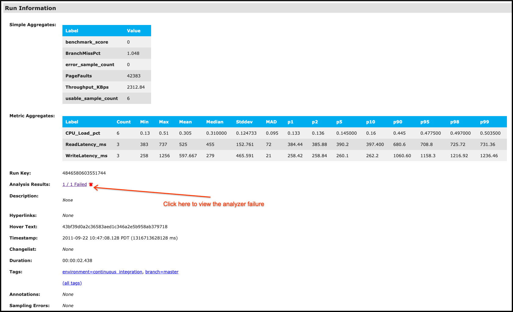
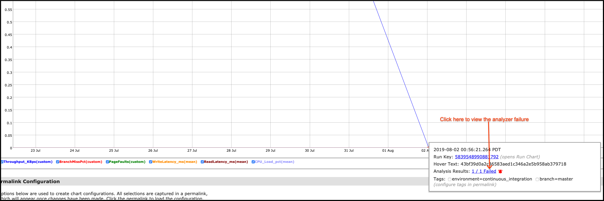
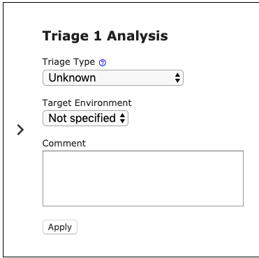

# Mako Analyzers

Mako analyzers are the key to Mako's regression detection capabilities.
Analyzers _analyze_ the data passed to Mako and either pass or fail the run
based on predetermined performance goals.

The intention is that an analyzer failure is treated like a correctness failure
-- stopping a release or submission, or leading to an automated test failure
that requires investigation.

The exact nature of the analysis depends on the analyzer type. The available
analyzer types are described below.

## Configuring analyzers

Analyzers are configured in the
[`QuickstoreInput`](../quickstore/quickstore.proto) argument to
the Quickstore constructor ([C++](../quickstore/cxx/quickstore.h),
[Go](../quickstore/go/quickstore.go)).

Here's a simple example:

```go
input := &qpb.QuickstoreInput{BenchmarkKey: proto.String(benchmarkKey)}
analysis := &tpb.ThresholdAnalyzerInput{
	Name: proto.String("Example Threshold Analyzer"),
	Configs: []*tpb.ThresholdConfig{
		{
			// Threshold on a metric aggregate.
			ConfigName: proto.String("check_m1"),
			Max:        proto.Float64(900),
			DataFilter: &mpb.DataFilter{
				DataType: mpb.DataFilter_METRIC_AGGREGATE_MEDIAN.Enum(),
				ValueKey: proto.String("ml"),
			},
		},
	},
}
input.ThresholdInputs = append(input.ThresholdInputs, analysis)

// Create the quickstore client with the configured analyzer.
q, closeq, err := quickstore.NewAtAddress(ctx, input, addr)
```

## Analyzer execution

The analyzers you configured in Quickstore will be executed after calling
`Store()`. The `QuickstoreOutput` object returned by the call will contain the
analyzer results:

```go
out, err := q.Store()
if out.GetStatus() == qpb.QuickstoreOutput_ANALYSIS_FAIL {
  // If you just want to output messages from the analyzer failures, use
  // GetSummaryOutput(). This output will contain a link to the analyzer
  // visualization on https://mako.dev.
  log.Errorf("Analyzer failure(s): %s", out.GetSummaryOutput())

  // Optionally, results from individual analyzers can be analyzed and acted
  // upon with GetAnalyzerOutputList():
  if failure := out.GetAnalyzerOutputList()[0]; failure.GetRegression() {
    log.Errorf("Detected a performance regression in run %s: %s", out.GetRunChartLink(), failure.GetOutput())
  } else {
    log.Errorf("Failed to execute analyzer: %s", failure.GetStatus().GetFailMessage())
  }
}
```

## Analyzer visualization

In addition to the textual analyzer output available in the `QuickstoreOutput`
message, the server displays visualization of the alleged performance
regression. The `QuickstoreOutput.GetSummaryOutput()` call demonstrated above
will link to this visualization. You can also reach the visualization from the
[Run Chart](CONCEPTS.md#run-charts):



Additionally, you can reach the visualization from the
[Aggregate Chart](CONCEPTS.md#aggregate-charts):



You can use this visualization web UI to understand how the analyzer's algorithm
interacts with the run data and historical data for your benchmark.

## Analyzer triage

Analysis triage is a feature within the analysis visualization that allows you
to categorize regressions flagged by analyzers.

When an analyzer flags a regression, the analysis visualization will include a
checkbox next to the analyzer title. Selecting one or multiple of these
checkboxes will open the triage form (shown below).



The fields of the triage form are as follows:

*   __Triage Type__ (required): Primary categorization of the analysis failure.
    *   Regression: This is a real product regression that needs to be resolved.
    *   False Positive: This is not a real regression, the analyzer
        configuration likely needs to be adjusted.
    *   Ignore/Intended Change: this is a real regression from the analysis
        perspective, but no action is needed. For example, this could be an
        expected change in product performance as a result of new features. A
        transient regression that has resolved itself, and for which no action
        is intended, also falls under this category.
    *   Unknown: The failure no longer requires attention, but the category is
        unknown.
*   __Target Environment__ : The type of environment where the test was run.
*   __Comment__: Any relevant comments or justification of the triage action.

Upon clicking __Apply__, the triage information entered will be applied to all
selected analyses.

> **NOTE**: You must be a benchmark owner to triage runs in that benchmark.

## Analyzer types

### Threshold analyzer

The Threshold analyzer evaluates data that is within expected bounds. For
example, you might specify that 95% of requests to your system take between 1
and 2 seconds.

Read more about the threshold analyzer at
[THRESHOLD_ANALYZER.md](THRESHOLD_ANALYZER.md).


### U-Test analyzer

The U-Test analyzer is an A/B analyzer. A/B analyzers are used to compare the output of two executions or two groups of executions. Assuming that both A and B run in well controlled environments, the analyzer can detect performance regressions introduced by a system/code under test or configuration change.

**Pros**

* A fast and statistically proven way to identify differences in two sets of data with specified confidence.
* Can identify performance creep by comparing against a golden run.

**Cons**

* Susceptible to inconsistent performance data. For example, if you run A twice and it varies by 50%, there is little point in making a comparison with B (i.e. garbage in, garbage out). However, the [Window Deviation Analyzer](WDA_ANALYZER.md) is built to handle these performance issues.
* Can miss performance creep when not comparing against a "golden run".

Read more about the U-Test analyzer at [UTSET_ANALYZER.md](UTEST_ANALYZER.md).

## Window Deviation Analyzer (WDA)

The WDA assesses the difference between recent mean or median and historic mean
or median via a user configured tolerance.

**Pros**

* Can detect small regressions in noisy data.
* Alerts upon notable changes, not constant bounds.
* Adapts to new trends by alerting when change is first noted, but starts passing once the new trend becomes normal.

**Cons**

* Can miss slow performance creep.
* If the analyzer adapts to a new trend, and the team ignores failures during the trend transition, a regression may be ignored.
* It may take days for a change to be "accepted" and the test to start passing again.

Read more about the WDA analyzer at [WDA_ANALYZER.md](WDA_ANALYZER.md).
