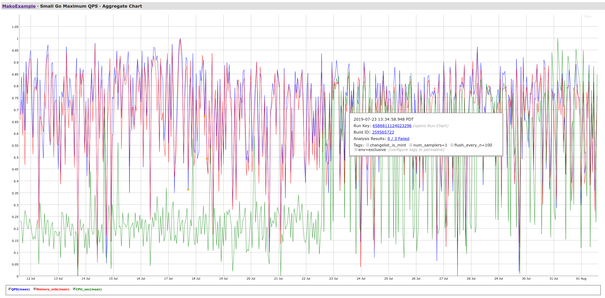
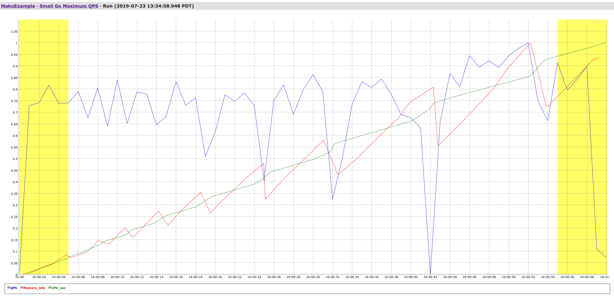

# Mako Concepts

## Performance testing

Performance tests come in all shapes and sizes, from microbenchmarks measuring the average walltime of a function execution to large-scale distributed load tests. Mako is designed to be very generic, accommodating performance tests of any scale and in any domain.

Mako’s focus is on pre-production performance testing. This distinguishes it from monitoring systems that are looking for performance regressions in running systems.

The ideal goal which Mako wants to help customers achieve is to create tests of a system’s performance which are:
maintainable
flexible enough to test any desired use case
automated, not requiring a human to inspect charts to look for performance regressions
used to block submissions or releases.

## Benchmarks

The term “benchmark” is a generic one that refers to some kind of performance
test, often a canonical one. In Mako, a benchmark is a container for holding
repeated executions of a performance test. A Mako benchmark is defined by the
`BenchmarkInfo` object in
[mako.proto](../spec/proto/mako.proto).

A Mako BenchmarkInfo defines which specific metrics the associated performance test will write. As the performance test evolves, the benchmark should evolve with it.

Benchmarks can be viewed on the https://mako.dev dashboard. To view all the benchmarks associated with a particular project foo, visit https://mako.dev/project?name=foo. For a real example, check out the Mako team’s benchmarks: https://mako.dev/project?name=MakoTeam. The chart associated with a benchmark is called the [Aggregate Chart](#aggregate-charts).

On the server, benchmarks are represented by a benchmark key. A benchmark with
benchmark key `5251279936815104` can be found at URL
https://mako.dev/benchmark?benchmark_key=5251279936815104 (or the shortcut
https://mako.dev/b/5251279936815104)

## Runs

A Mako run represents a single execution of a performance test. A run is defined
by the RunInfo object in
[mako.proto](../spec/proto/mako.proto).

Runs can be viewed on the https://mako.dev dashboard. When viewing an Aggregate Chart, each point represents a run. Click on the run key to get to the [Run Chart](#run-charts). When using Quickstore, the `QuickstoreOutput` (see
[mako.proto](../proto/quickstore/quickstore.proto)) returned by the `Quickstore.Store()` call contains a link to the run that was created.

Mako runs usually can have [tags](#tags) associated with them.

On the server, runs are represented by a run key. A run with a run key `6559884027887616` can be found at URL https://mako.dev/run?run_key=6559884027887616 (or the shortcut https://mako.dev/r/6559884027887616).

## Tags

Tags are used to mark runs as coming from a particular environment, having been configured in a particular way, or otherwise having some property that can be used to group runs together or distinguish between runs in different categories.

This is important when different runs in the same benchmark have different expected performance characteristics depending on some environmental or configuration factor. So the runs in a hypothetical benchmark that have the `host_machine=bigbeefy` tag might not be comparable to the runs with tag `host_machine=laptop`. This is a great example of a useful tag.

Tags are used in https://mako.dev dashboards to filter Aggregate Charts to only show runs matching that tag. When viewing a Run Chart, scroll down to the *Tags* section to see the tags associated with that run. Clicking on one of the tags will take you to the Aggregate Chart for the benchmark, but with the runs filtered to only those having the clicked-on tag.

Tags are also used when querying Mako, either with the [CLI](CLI.md) or with the storage libraries (STORAGE_LIBRARY.md).

Lastly, tags are used in the configuration for [analyzers](ANALYZERS.md) which can query history. This makes sense, since you usually want to compare the runs from one configuration/environment against runs from the same configuration/environment.

Learn more by reading [TAGS.md](TAGS.md).

## Aggregate Charts

Aggregate charts show the behavior of a benchmark over time. They are the
primary way of visualizing benchmarks in Mako. Here's an example:

Time is on the x-axis in this chart, and we are displaying three color-coded
time-series: **QPS(mean)**, **Memory_mib(mean)**, and **CPU_sec(mean)**. Each of
those time series corresponds to a metric in the
`BenchmarkInfo.metric_info_list` (see [mako.proto](../spec/proto/mako.proto)).
By default, the mean of each of those metrics is displayed. You can scroll down
to configure the chart to plot alternative aggregates (e.g. median, 99th
percentile, etc), along with configuring many other charting options.

In the above screenshot, the user has clicked on a run, causing metadata about
the run to be displayed, including:
* a link to open the run's run chart
* a numeric Build ID
* the results of [analyzer](#analyzers) runs
* the tags applied to that run

## Run Charts

Run charts show the results of a single run of a benchmark. They are the primary
way of visualizing runs in Mako. Here's an example:

Time is on the x-axis, and we are displaying the same three metrics discussed in
the [Aggregate Charts](#aggregate-charts) section above, except that now we're
displaying the raw data instead of an aggregate like the mean or median.

Again, we can scroll down to configure all kinds of charting options, including
which metrics are being displayed and how they're displayed.

## Quickstore

Quickstore is the high-level Mako client for adding performance test data to
Mako as new [runs](#runs). It is available in Go and C++. Please see
[QUICKSTORE.md](QUICKSTORE.md) for Quickstore documentation.

## Storage Clients

Mako storage clients provide direct programmatic access to Mako performance data
when Quickstore isn't sufficient. They provide capabilities like querying for
benchmarks and runs, modifying and deleting benchmarks and runs, etc.

These storage clients aren't convenient to use for adding performance test data
to Mako (that's why [Quickstore](#quickstore) exists), but they're the right
tool for many alternative use cases.

## Analyzers

See [ANALYZERS.md](ANALYZERS.md).

## Microservice
The core of Mako's code is built in C++, spread across many C++ libraries that
are built using Bazel (or Google's internal equivalent). When using Bazel we
can use [SWIG](http://www.swig.org/) to wrap this C++ code and make it available
in other languages. This is much more difficult in a `go build/test` based
build, however, as `go build`'s SWIG support seems better suited to simpler,
single-library use cases.

Thus, the strategy for `go build/test` based code is to import a thin, pure Go
library that implements the Quickstore API and communicates over
[gRPC](https://grpc.io/) with a _microservice_ -- a separate process -- that
contains all the Mako C++ logic. This ends up being somewhat similar to how
Docker works -- when you run Docker commands using the Docker CLI, REST commands
are issued to the
[Docker daemon](https://docs.docker.com/engine/reference/commandline/dockerd/),
which does the work.

When automating performance tests that use Go Quickstore with `go build`, you'll
have to arrange for the microservice to be built by by your test (or pulled
from a prebuilt location) and started, so that it listens for client
connections.
